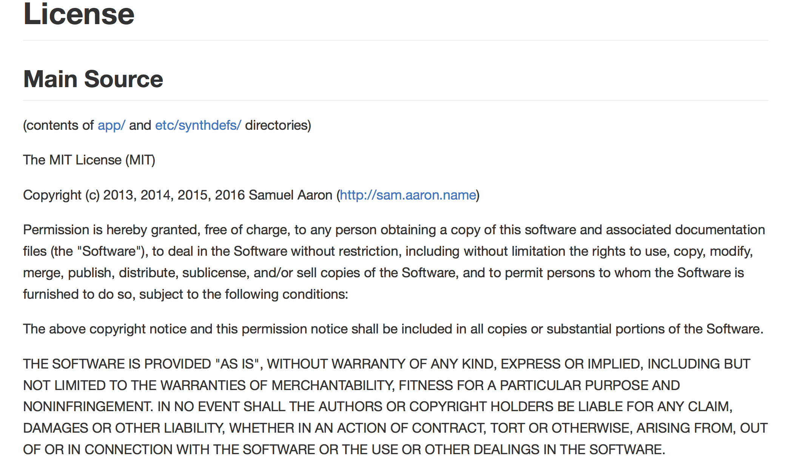

# Liberté d'apprendre et logiciels libres
Présentation au Colloque libre de l’Adte    
Collège Dawson, 17 mars 2016    
Alexandre Enkerli, Vitrine technologie-éducation    
[aenkerli@vteducation.org](mailto:aenkerli@vteducation.org "Adresse de courriel, Alexandre Enkerli")    
[http://lar.me/clibre2016](http://lar.me/clibre2016)    

# VTÉ: mission technopédagogique

- **Innovation pédagogique**: laboratoires
- **Patrimoine éducatif**: ressources éducatives libres
- **Choix technologiques**: achats regroupés

# Description
> La liberté est une valeur fondamentale de l’enseignement supérieur. Comme c’est le cas pour la liberté logicielle, le mouvement pour l’éducation libre dépasse largement la notion de gratuité pour atteindre notre capacité d’agir au-delà des contraintes.
> En lien avec d’autres actions de l’Adte, cette présentation a pour but de promouvoir la collaboration entre défenseurs du logiciel libre et acteurs de domaines connexes, des données ouvertes aux ressources éducatives libres.

# Liberté d’apprendre?

## 

## Qu’est-ce que ça implique?

## Capacité d’action (“agency”)

## Obstacles?

# Liberté logicielle?

## Qu’est-ce que ça implique?

## Capacité d’action (“agency”)

## Obstacles?

# Ressources libres (REL)
## UNESCO 2012
> Les Ressources éducatives libres (REL) sont tous types de matériel éducatif dans le domaine public ou publiés avec une licence libre de droits. De par sa nature même, ce matériel libre peut être, en toute légalité, reproduit, utilisé, adapté et partagé plusieurs fois par quiconque. Les REL peuvent être des manuels, des programmes, des notes de cours, des devoirs, des tests, des projets, des docments audio, des vidéos et des dessins animés.    
Source: [UNESCO (2012): «Les Ressources Éducatives Libres (REL) : qu'est-ce que c'est ?»](http://www.unesco.org/new/fr/communication-and-information/access-to-knowledge/open-educational-resources/what-are-open-educational-resources-oers/ "Les Ressources Éducatives Libres (REL) : qu'est-ce que c'est ? | Organisation des Nations Unies pour l'éducation, la science et la culture")

## Les Cinq ‘R’ de David Wiley
1. «Retenir» (“Retain”): copier
2. «Réutiliser» (“Reuse”): réapproprier
3. «Réviser» (“Revise”): adapter
4. «Remixer» (“Remix”): intégrer
5. «Redistribuer» (“Redistribute”): partager

Source: [Wiley, David (2014): “The Access Compromise and the 5th R”](http://opencontent.org/blog/archives/3221 "The Access Compromise and the 5th R | iterating toward openness")

# Ouverture du Web
## WWW2016.ca: le W3C à Montréal
- Comité du Web
- Du 11 au 15 avril, au Palais des congrès
- Invité spécial, Tim Berners-Lee
- Baronne Martha-Lane Fox, chancelière de l’Open University

## Open Knowledge Fest (#OKFestMtl): 12 avril, Palais des congrès

[Pour plus d’info: ca.okfn.org/okfestmtl](http://ca.okfn.org/okfestmtl/ "Open Knowledge Festival de Montréal: Festival des réseaux du Web
accessible, libre et participatif #OKFestMTL | OKFN Canada") ou #OKFestMtl

# Apprentissage par le logiciel libre:    Sonic Pi

## Sonic Pi
### 

## Programmation musicale pour tous

## Intégration Minecraft (sur Raspberry Pi)
    

## Intégration Minecraft (sur Raspberry Pi)
: Minecraft depuis Sonic Pi")    
Source: [Aaron, Sam (2016) “Sonic Pi Essentials : Code Music with Sonic Pi ”. The MagPi Magazine](https://www.raspberrypi.org/magpi/issues/essentials-sonic-pi-v1/ "Sonic Pi Essentials : Code Music with Sonic Pi | The MagPi Magazine")

## Le libre Sonic Pi
### Logiciel sous [Licence MIT](https://github.com/samaaron/sonic-pi/blob/master/LICENSE.md "Sonic Pi License | GitHub")

### Basé sur [SuperCollider](http://supercollider.github.io/ "Page d’accueil, SuperCollider") ([licence](http://doc.sccode.org/Other/Licensing.html "SuperCollider Licensing") [GPL](http://www.gnu.org/licenses/gpl-3.0.fr.html "Licence publique générale GNU, v3.0 - Projet GNU - Free Software Foundation"))

### Échantillons dans le domaine public ([CC0](http://creativecommons.org/publicdomain/zero/1.0/deed.fr "Creative Commons — CC0 1.0 universel"))

### Documentation, exemples et tutoriel en [CC-BY-SA](http://creativecommons.org/licenses/by-sa/4.0/deed.fr "Creative Commons — Attribution - Partage dans les Mêmes Conditions 4.0 International — CC BY-SA 4.0")    

## Tutoriel pédagogique

# Partager en code source
## GitHub en éducation

## Exemples dans Gist

## Présentation dans Gist
    
[http://lar.me/clibre2016](http://lar.me/clibre2016)    

